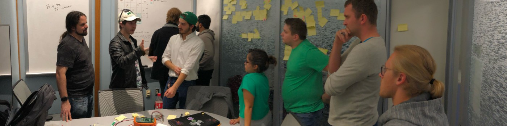
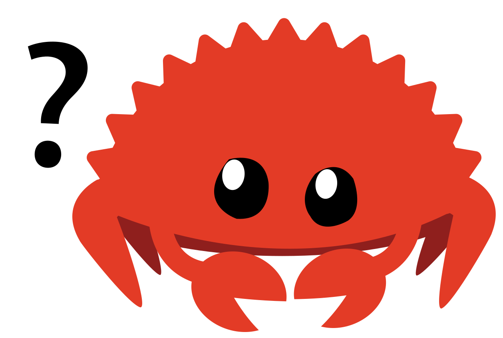
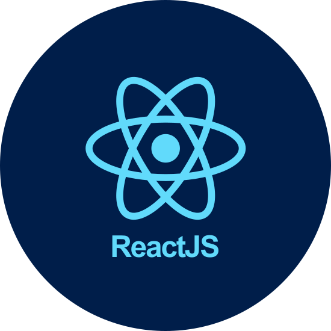
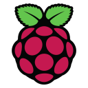

Hi,  I'm <a href="https://www.linkedin.com/in/tyleradammartinez/">Tyler Adam Martinez</a>. I'm a Software Consultant for <a href="https://www.respec.com/">RESPEC</a>.
  

  
<b>Experience</b>

    
  <pre>
  - 👔 <a href="https://www.respec.com/">RESPEC</a> Software Consultant (3 year 1 month)
  - 👨🏻‍💻 <a href="https://www.codestreamstudios.com/">CodeStream Studios</a> Software Development Engineer (4 month)
  - 👨🏻‍🏫 <a href="https://www.codestreamstudios.com/">CodeStream Studios</a> Coding Instructor (1 year 10 months)
  - 👨🏻‍💼 <a href="https://unthackathon.com/">HackUNT</a> Officer (2 years 1 months)
  - 🌐 <a href="https://www.ntdaily.com/">NTDaily</a> Webmaster (2 years)
  - 🙋🏻‍♂️ <a href="https://engineering.unt.edu/">UNT</a> Robotics Tutor (1 year 10 months)
  - 💰 <a href="https://www.untrobotics.com/">UNT Robotics</a> Treasurer (2 years)
  - 🤖 <a href="https://www.untrobotics.com/">UNT Robotics</a> Competition Robotics (4 years)</pre>

**Languages and Tools:**  

