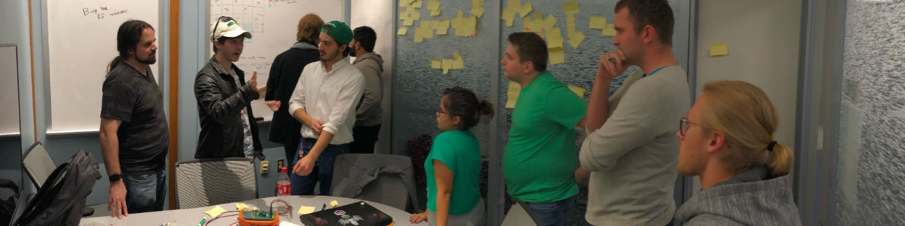

Hi,  I'm <a href="https://www.linkedin.com/in/tyleradammartinez/">Tyler Adam Martinez</a>. I'm a Software Development Engineer for <a href="https://www.codestreamstudios.com/">CodeStream Studios</a>.
  Check out my **resume** 
(🙋 <a href="Assets/Resumes/Resume-2022-InPerson.pdf">Human Firendly version</a>) 
(🤖 <a href="Assets/Resumes/Resume-2022-InPerson.pdf">Robot/ATS Firendly version</a>)

  
<b>Github Stats </b>

  <!-- 

    
  
 -->
  

    
  

  

    
    

  
<b>Experience</b>

    
  <pre>
  - 👨🏻‍💻 <a href="https://www.codestreamstudios.com/">CodeStream Studios</a> Software Development Engineer (3 month)
  - 👨🏻‍🏫 <a href="https://www.codestreamstudios.com/">CodeStream Studios</a> Coding Instructor (8 months)
  - 👨🏻‍💼 <a href="https://unthackathon.com/">HackUNT</a> Officer (9 months)
  - 🌐 <a href="https://www.ntdaily.com/">NTDaily</a> Webmaster (2 years)
  - 🙋🏻‍♂️ <a href="https://engineering.unt.edu/">UNT</a> Robotics Tutor (1 year 10 months)
  - 💰 <a href="https://www.untrobotics.com/">UNT Robotics</a> Treasurer (2 years)
  - 🤖 <a href="https://www.untrobotics.com/">UNT Robotics</a> Competition Robotics (4 years)</pre>

**Languages and Tools:**  

